

# Magic Storage

A Terraria-inspired and simple storage network solution mod for Minecraft 1.12.2. Centralize all your items into a single Storage Heart, access them from any Storage Access terminal, use the Crafting Access to craft with your entire network inventory.

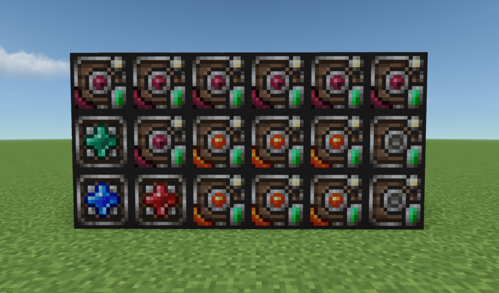

## Quick Start

1. Craft a **Storage Component*(the base crafting material).
2. Craft a **Storage Heart*and place it.
3. Craft a **Basic Storage Unit*and place it adjacent to the Storage Heart.
4. Craft a **Storage Access*or **Crafting Access*and place it anywhere connected to the heart.
5. Open the access terminal. Items placed in storage units become accessible from every access point by placing **Remote Access**.
6. (Optional) Feed your crafting stations into the Storage Heart's inventory (right-click the heart). Place brewing stands, furnaces, anvils, enchanting tables, and crafting tables there. The Crafting Access will detect them.

## Blocks & Items

### Storage Component
Iron ingots, chests, and redstone. Used in nearly every recipe.

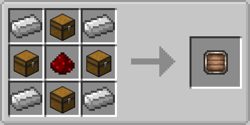

### Storage Heart
The core of your network. It has a 20-slot inventory for placing crafting stations (brewing stand, furnace, anvil, enchanting table, crafting table). The heart chunk-loads itself so remote access works across dimensions. Break it to disconnect the network.

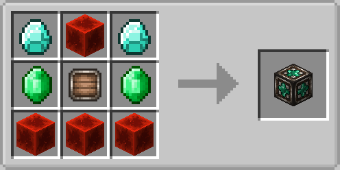

### Storage Access
Right-click to open a terminal. Browse all items in the network, search by name, sort by name/amount/mod. Click an item to pull it to your cursor. Shift+click to send it to your inventory. Insert items from your cursor into the network by clicking in the empty area.

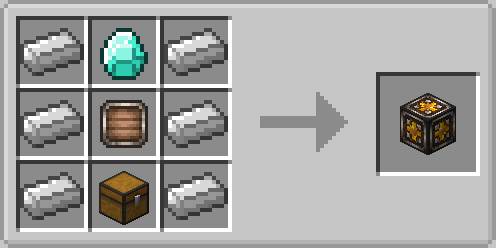

### Crafting Access
A crafting table that uses your network inventory. Place a crafting table in the Storage Heart to enable the basic 3x3 crafting grid. Place additional crafting stations in the heart to unlock more features:

- **Crafting Table**: <u>REQUIRED</u> in order to operate the Crafting Access.
- **Furnace**: Smelt items directly from the crafting grid. Place fuel in the middle slot (currently supports coal or charcoal) and smeltable items in the rest of the slots.
- **Enchanting Table**: Enchant items using the grid. Place the item in slot 1, lapis lazuli in slots 4/5/6 (any position). Bookshelf power is calculated from bookshelf items in your network storage. Works with modded table enchants and modded bookshelves.
- **Anvil**: Combine enchantments or repair items. Place the target item in slot 1, the material or other item in slot 5. Uses real vanilla anvil logic including XP costs. Shows the final result before you commit.
- **Brewing Stand**: Brew potions. Place blaze powder in slot 1, the ingredient in slot 2, potion bottles in slots 4/5/6. Has 5% chance of consuming the blaze powder.

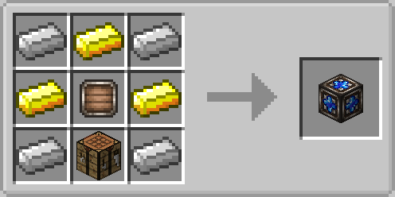

### Remote Access Block
Links portable access items to the Storage Heart. Place it adjacent to the heart. Portable items can access the network from anywhere (within range/dimension limits).

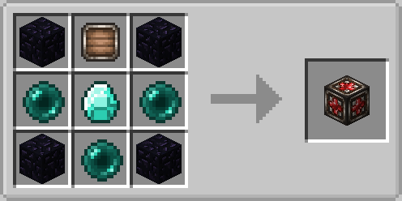

### Hell Bricks
Material building block. Puts entities on fire that are standing on it if without fire resistance.

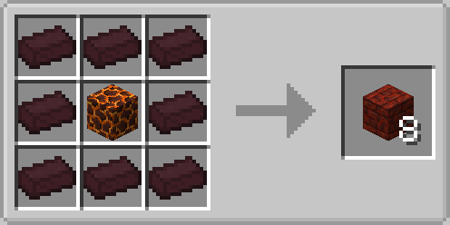

## Storage Units (8 Tiers)

Place adjacent to the Storage Heart. Each tier has more capacity.

Shift+right-click a storage unit to see its usage. Right-click to open and manage its contents. Use upgrades by holding them and shift+right-clicking the unit to upgrade in place.

### Basic Unit
**Slots:** `40`
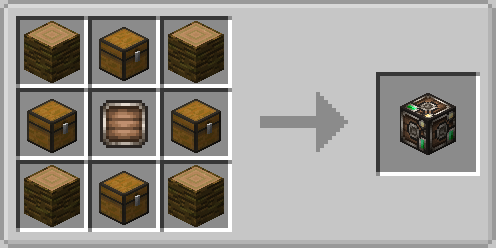

### Crimtane Unit
**Slots:** `80`
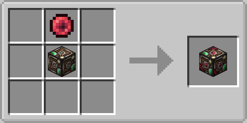

### Demonite Unit
**Slots:** `80`
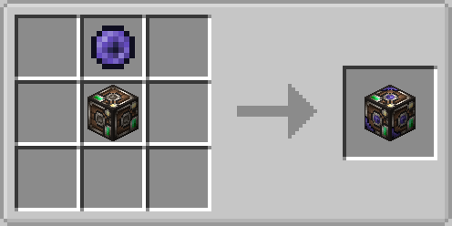

### Hellstone Unit
**Slots:**  `120`
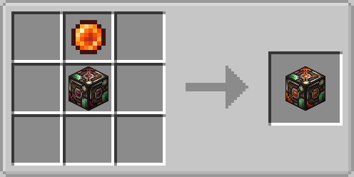

### Hallowed Unit
**Slots:** `160`

### Blue Chlorophyte Unit
**Slots:** `220`
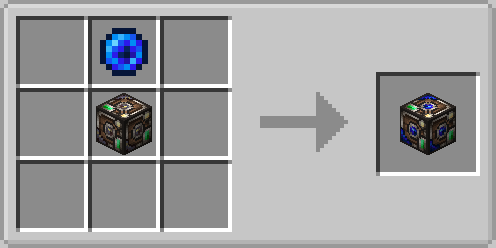

### Luminite Unit
**Slots:** `300`
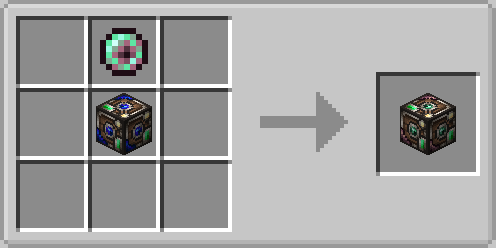

### Terra Unit
**Slots:** `600`
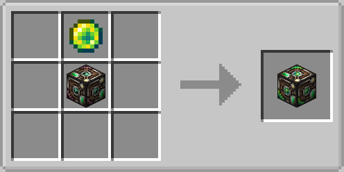

## Upgrades

Shift+right-click a storage unit while holding an upgrade to apply it. The upgrade is consumed and the unit gains more slots.

### Crimtane Upgrade
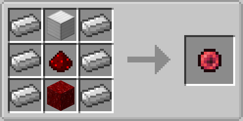

### Demonite Upgrade

### Hellstone Upgrade
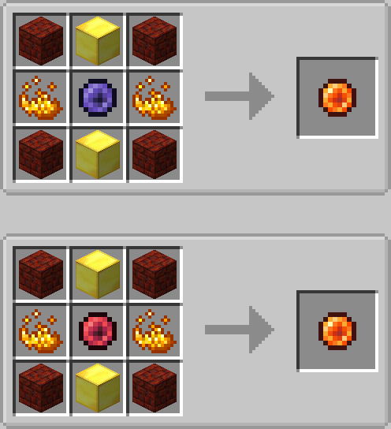

### Hallowed Upgrade
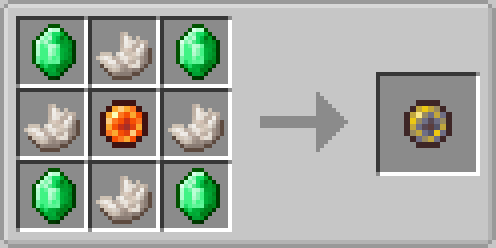

### Blue Chlorophyte Upgrade
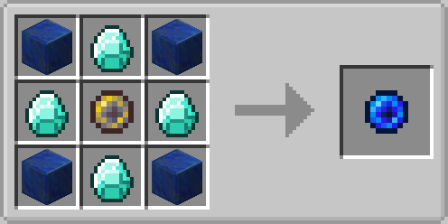

### Luminite Upgrade
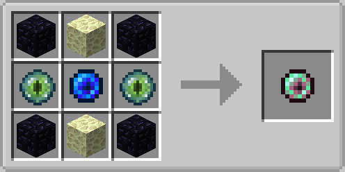

### Terra Upgrade
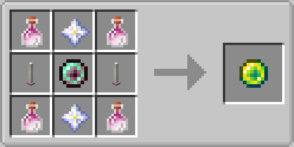

## Portable Storage Access Remotes (3 Tiers)

Access your network from anywhere. Right-click to open. Two variants: Storage Access (browse + insert/extract) and Crafting Access (with crafting grid and station support).

### Simple Remote Storage Access
**Range:** 200 blocks
**Cross-Dimension:** No
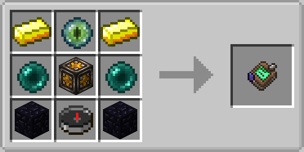

### Advanced Remote Storage Access
**Range:** Unlimited
**Cross-Dimension:** No

### Ultimate Remote Storage Access
**Range:** Unlimited
**Cross-Dimension:** Yes
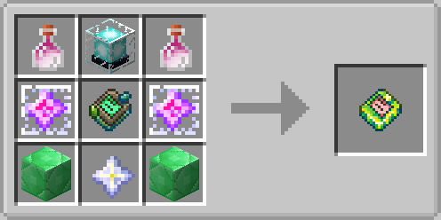

## Portable Crafting Access Remotes (3 Tiers)

### Simple Remote Crafting Access
**Range:** 200 blocks
**Cross-Dimension:** No
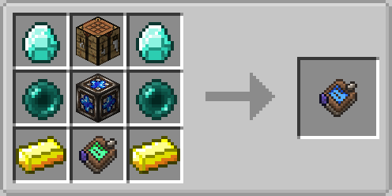

### Advanced Remote Crafting Access
**Range:** Unlimited
**Cross-Dimension:** No
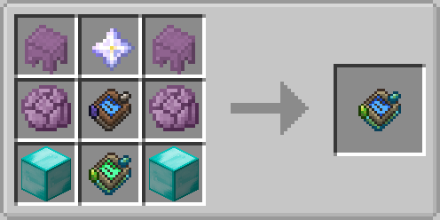

### Ultimate Crafting Access
**Range:** Unlimited
**Cross-Dimension:** Yes
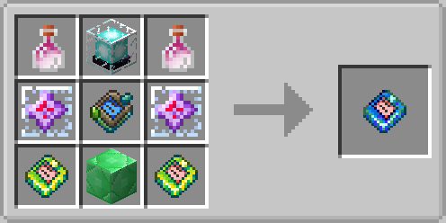

## JEI Integration

All recipes are accessible via JEI, besides for dynamic crafting using stations. In such case, JEI shows recipe categories for each crafting station: Anvil, Brewing, Enchanting, Smelting. The Crafting Access acts as a catalyst for all categories.

## Configuration

The config file is at `.minecraft/config/magicstorage.cfg`.

- **softAutoSortEnabled**: (default: true) When enabled, items are automatically moved into storage units that already contain matching items with available space. **Thus, it is safe and does not move items to new slots!**  only consolidates into existing ones to save storage space.
- **softAutoSortIntervalSeconds**: (default: 60, range: 10-3600) How often in seconds the soft auto-sort runs to consolidate items across storage units.

## Demos

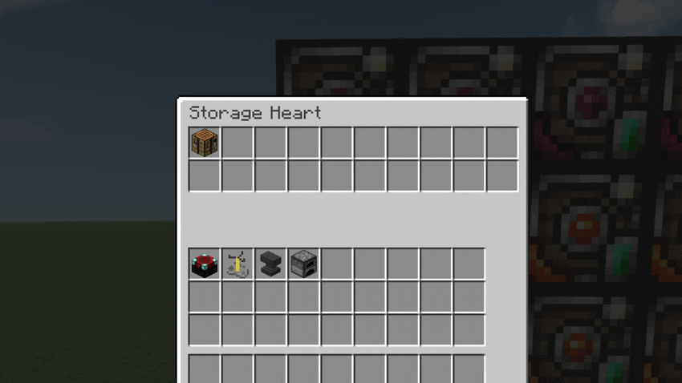
*Place stations into the Storage Heart to unlock features in the Crafting Access.*

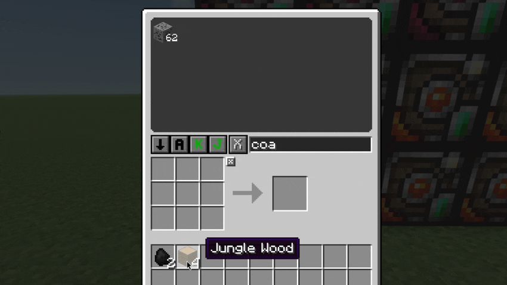
*Smelt logs into charcoal using the furnace station.*

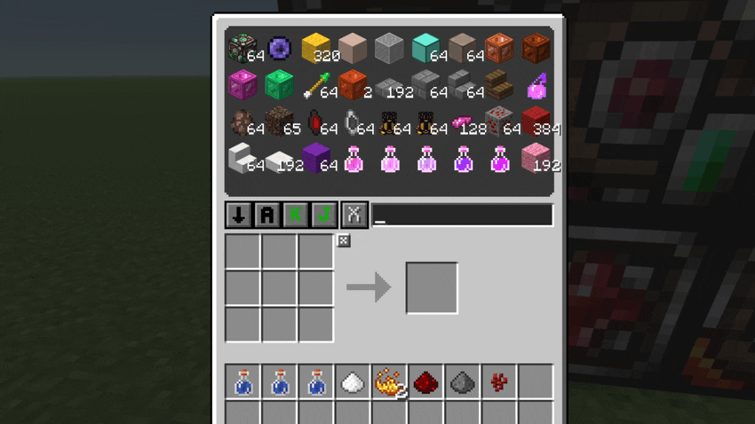
*Brew splash potions and use redstone to make them long lasting.*

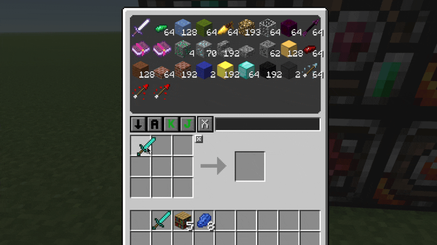
*Enchant items on the crafting grid with 3 lapis. Add bookshelves to storage to increase levels. Enchants refresh in real time.*

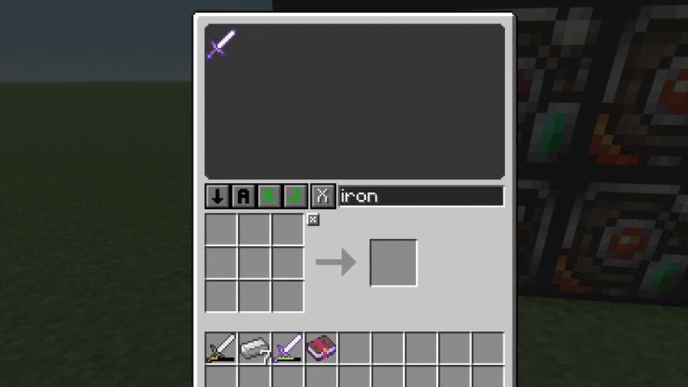
*Repair two iron swords, combine them, and see the insufficient XP warning.*

*Bind and use portable remote access items.*

*Upgrade 6 storage units with upgrade items.*

## Notes

- In contrast to SSN mod, The Storage Heart uses ForgeChunkManager to keep its chunk loaded for cross-dimensional access.
- Station items (furnace, anvil, brewing stand, etc.) must be IN the Storage Heart's inventory, not placed in the world.
- Bookshelf power for enchanting is calculated from bookshelf ITEMS in your network storage units, not from blocks placed in the world.
- The Crafting Access detects stations in real-time. Add or remove stations from the heart's inventory and the grid updates immediately.
- Items in the crafting grid return to the network when you close the GUI.
- If storage units are broken, if they are a part of a network, they move their items to units that are closest to the storage heart. If for any reason the network doesnt have enough space, it will move as many items as it can and the rest will drop upon breaking.
- Upgrading units in-place expands their storage (preserves their items)
- Storage units supports hoppers for automation

## Compatibility

**WARNING**: This mod uses Java reflection to access vanilla `ContainerRepair` (for the anvil crafting feature). It has been tested with Forge **14.23.5.2864*client. Other versions may work but are not guaranteed. If you encounter crashes related to reflection, try updating or downgrading Forge to the tested version.

## Credits & Third-Party Code
**[Storage Network](https://github.com/Lothrazar/Storage-Network)*by Lothrazar — Portions of [mention feature/code area] were adapted from this project under the [MIT License](https://github.com/Lothrazar/Storage-Network/blob/master/LICENSE).
