[← Back to Wiki Hub](../README.md) | [Main Documentation](../../README.md)

# Magic Storage Recipe Catalog & Station Demonstrations

This catalog contains high-resolution crafting recipes for all **Magic Storage** items and blocks, as well as demonstration recipes for all dynamic station integrations supported within the **Crafting Access**.

---

## Table of Contents
- [Core Components & Blocks](#1-core-components--blocks)
- [Storage Units (8 Tiers)](#2-storage-units-8-tiers)
- [Storage Upgrades](#3-storage-upgrades)
- [Portable Storage Remotes](#4-portable-storage-remotes)
- [Portable Crafting Remotes](#5-portable-crafting-remotes)
- [Dynamic Station Demonstrations](#6-dynamic-station-demonstrations)
  - [Furnace Smelting](#furnace-smelting-demonstration)
  - [Enchanting Table](#enchanting-table-demonstration)
  - [Anvil Repair & Combining](#anvil-repair--combination-demonstrations)
  - [Brewing Stand](#brewing-stand-demonstration)
  - [Rustic Alchemy (Simple & Advanced)](#rustic-alchemy-demonstrations)
  - [Rustic Brewing Barrel](#rustic-brewing-barrel-demonstration)
  - [Rustic Crushing Tub](#rustic-crushing-tub-demonstration)
  - [Disenchanter Table](#disenchanter-table-demonstration)
  - [Bountiful Baubles Reforger](#bountiful-baubles-reforger-demonstration)
  - [Quality Tools Reforging Station](#quality-tools-reforging-station-demonstration)

---

## 1. Core Components & Blocks

### Storage Component
The base crafting component used in virtually every block, upgrade, and remote recipe in Magic Storage.

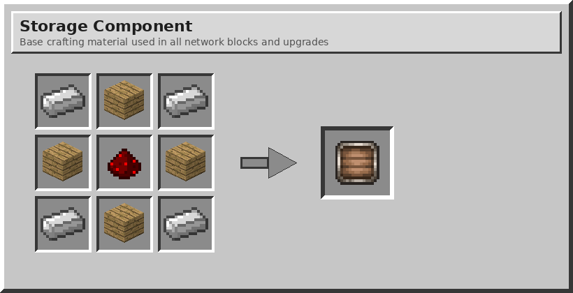

- **Ingredients:** 4x Iron Ingots, 4x Wooden Chests, 1x Redstone Dust.
- **Yield:** 1x Storage Component.

---

### Storage Heart
The central core of your storage network. Contains a 20-slot inventory for crafting stations, emits Light Level 15 (Sea Lantern brightness), and chunk-loads the network.

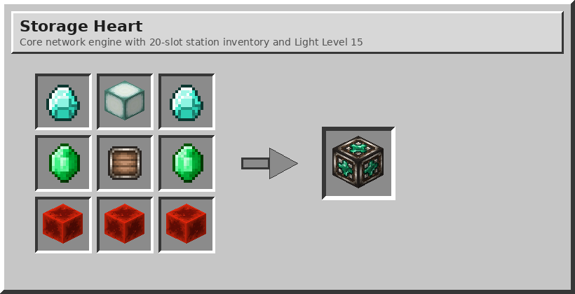

- **Ingredients:** 2x Diamonds, 1x Sea Lantern, 2x Emeralds, 1x Storage Component, 3x Redstone Blocks.
- **Yield:** 1x Storage Heart.

---

### Storage Access Terminal
The access terminal for browsing, searching, sorting, depositing, and withdrawing network items.

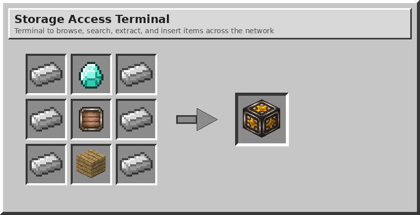

- **Ingredients:** 7x Iron Ingots, 1x Diamond, 1x Storage Component, 1x Wooden Chest.
- **Yield:** 1x Storage Access.

---

### Crafting Access Interface
The crafting terminal connected to your network. Provides a 3x3 crafting grid with multi-station mechanics and 3-state autofill.

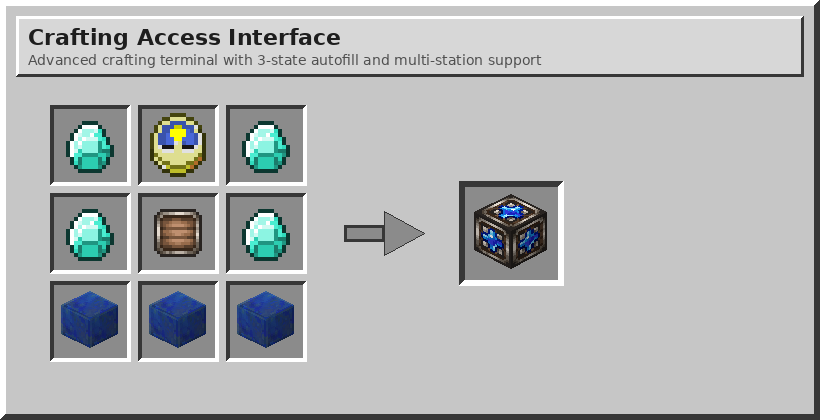

- **Ingredients:** 4x Diamonds, 1x Clock, 1x Storage Component, 3x Lapis Lazuli Blocks.
- **Yield:** 1x Crafting Access Interface.

---

### Remote Storage Access Block
The physical anchor block required to link wireless portable remotes to your Storage Heart network.

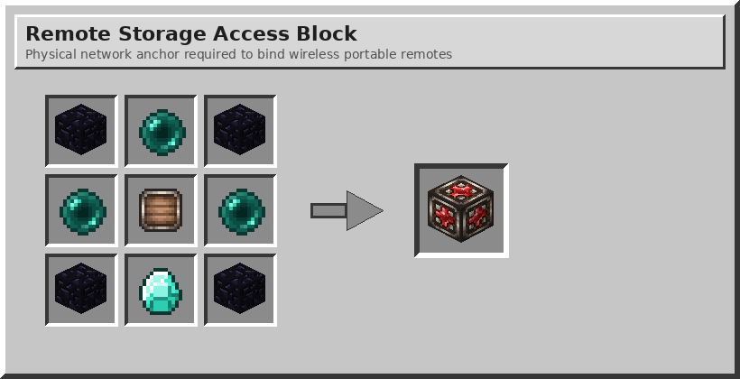

- **Ingredients:** 4x Obsidian, 3x Ender Pearls, 1x Storage Component, 1x Diamond.
- **Yield:** 1x Remote Storage Access Block.

---

### Hell Bricks (x8)
A defensive and building block. Ignites entities standing on it for 3 seconds unless protected by Fire Resistance.

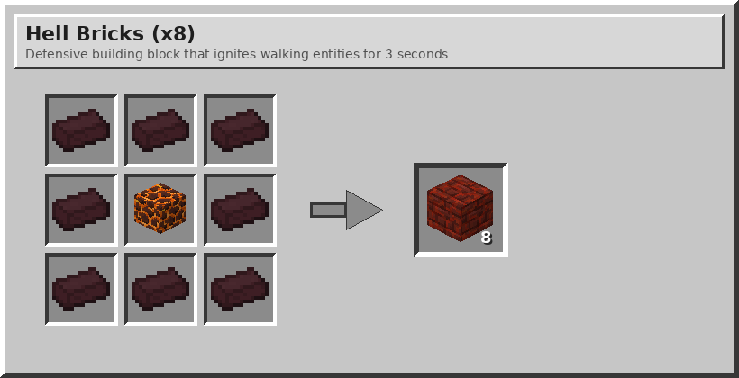

- **Ingredients:** 8x Nether Bricks, 1x Magma Block.
- **Yield:** 8x Hell Bricks.

---

## 2. Storage Units (8 Tiers)

Storage Units can be crafted directly with crafting table recipes or upgraded in-place using upgrade items.

| Storage Unit | Slot Capacity | Crafting Recipe |
| :--- | :---: | :--- |
| **Basic Storage Unit** | 40 Slots | 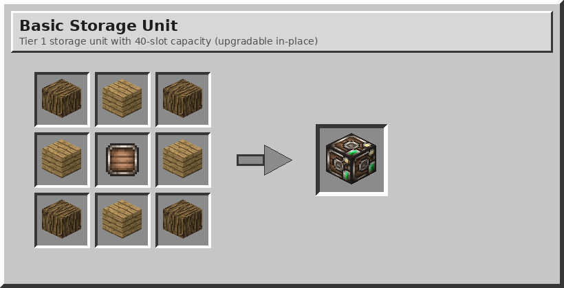 |
| **Crimtane Storage Unit** | 80 Slots | 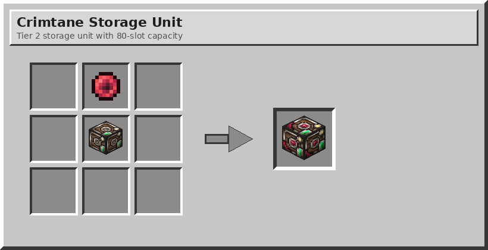 |
| **Demonite Storage Unit** | 80 Slots | 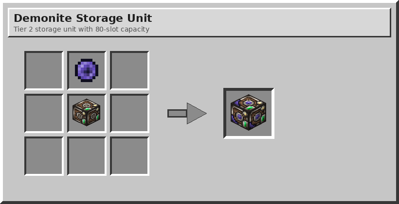 |
| **Hellstone Storage Unit** | 120 Slots | 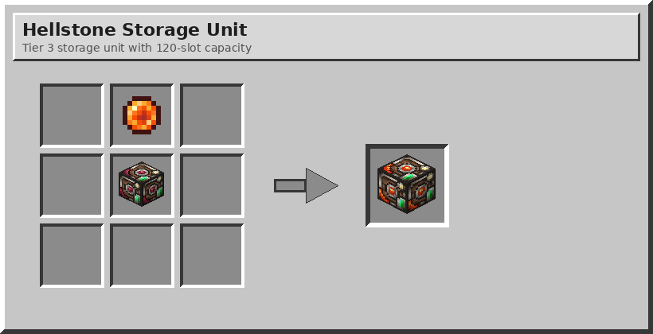 |
| **Hallowed Storage Unit** | 160 Slots | 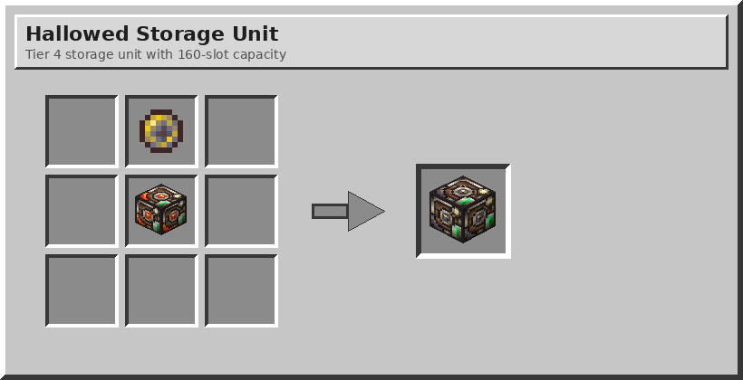 |
| **Blue Chlorophyte Unit** | 220 Slots | 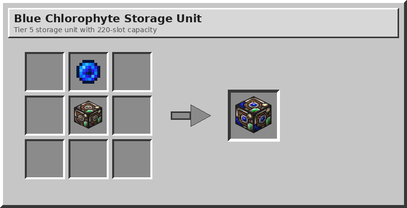 |
| **Luminite Storage Unit** | 300 Slots | 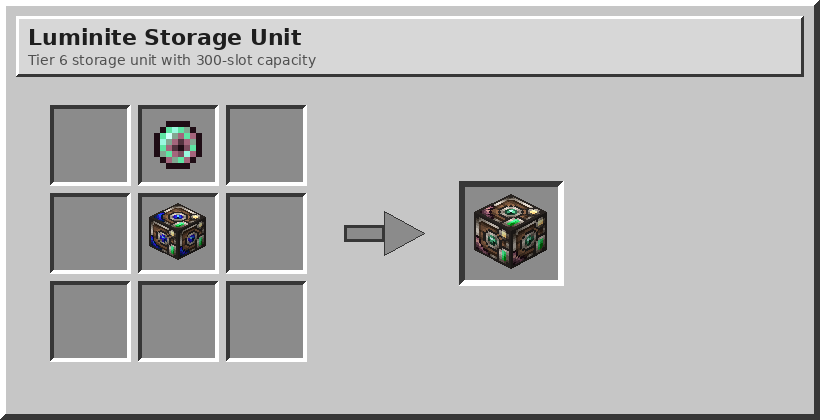 |
| **Terra Storage Unit** | 600 Slots | 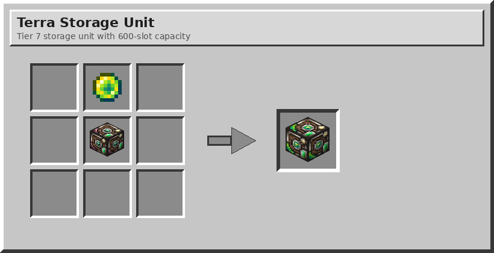 |

---

## 3. Storage Upgrades

Hold an upgrade item and **Shift+Right-Click** an existing storage unit in the world to upgrade it in-place without losing items.

### Crimtane Storage Upgrade (Basic $\rightarrow$ Crimtane, 80 slots)
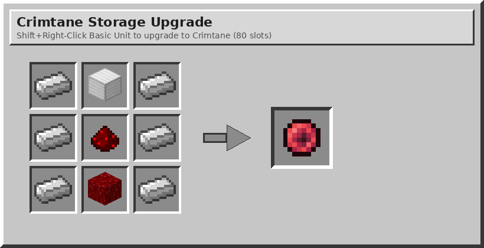

### Demonite Storage Upgrade (Basic $\rightarrow$ Demonite, 80 slots)
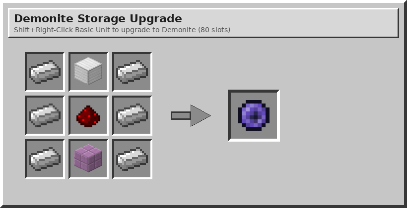

### Hellstone Storage Upgrade (Crimtane $\rightarrow$ Hellstone, 120 slots)
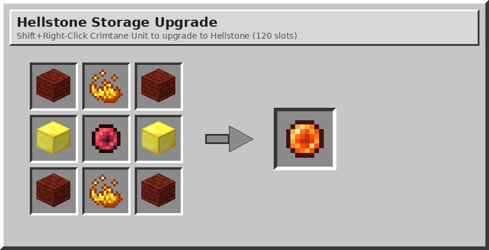

### Hellstone Storage Upgrade from Demonite (Demonite $\rightarrow$ Hellstone, 120 slots)
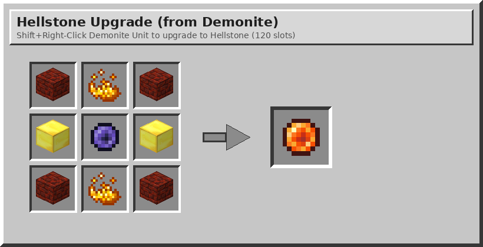

### Hallowed Storage Upgrade (Hellstone $\rightarrow$ Hallowed, 160 slots)
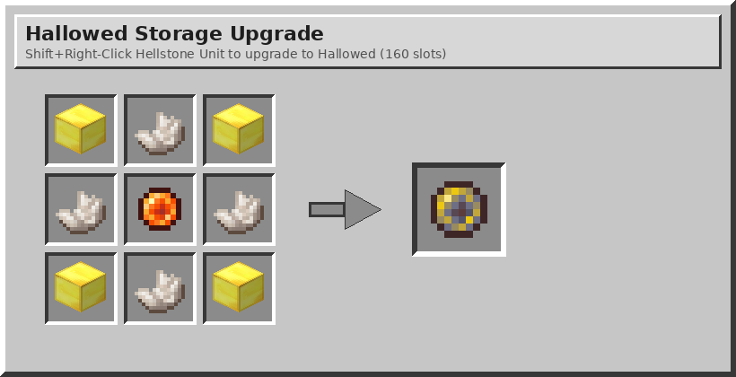

### Blue Chlorophyte Storage Upgrade (Hallowed $\rightarrow$ Chlorophyte, 220 slots)
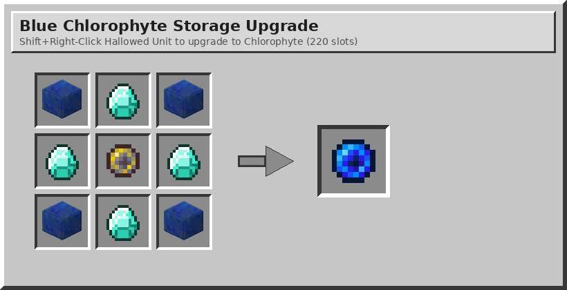

### Luminite Storage Upgrade (Chlorophyte $\rightarrow$ Luminite, 300 slots)
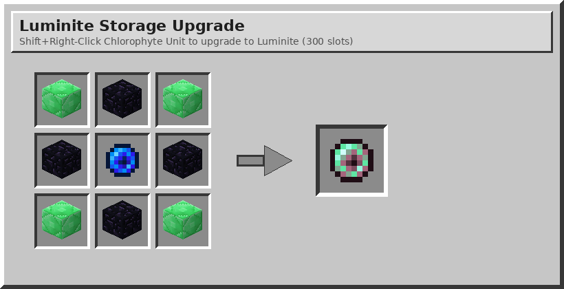

### Terra Storage Upgrade (Luminite $\rightarrow$ Terra, 600 slots)
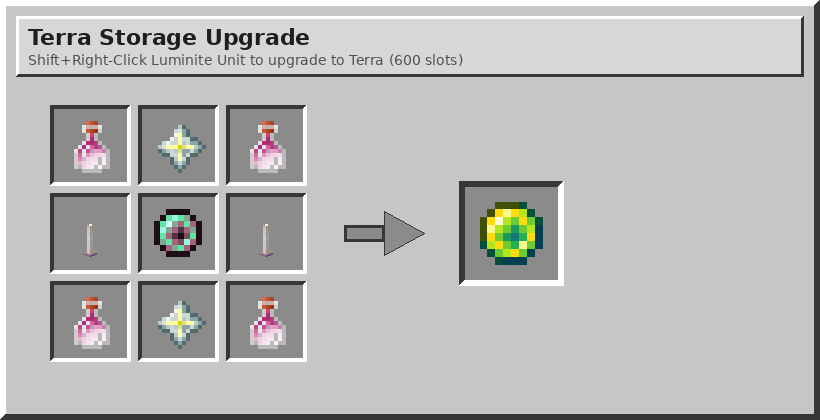

---

## 4. Portable Storage Remotes

Wireless remotes for browsing and managing items. Bind by **Sneak+Right-Clicking** a placed **Remote Storage Access** block.

### Basic Portable Storage Access (PreHM)
- **Range:** 200 blocks (same dimension).
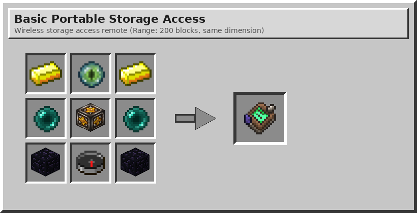

### Advanced Portable Storage Access (HM)
- **Range:** Unlimited (same dimension).

### Ultimate Portable Storage Access
- **Range:** Unlimited across **all dimensions**.
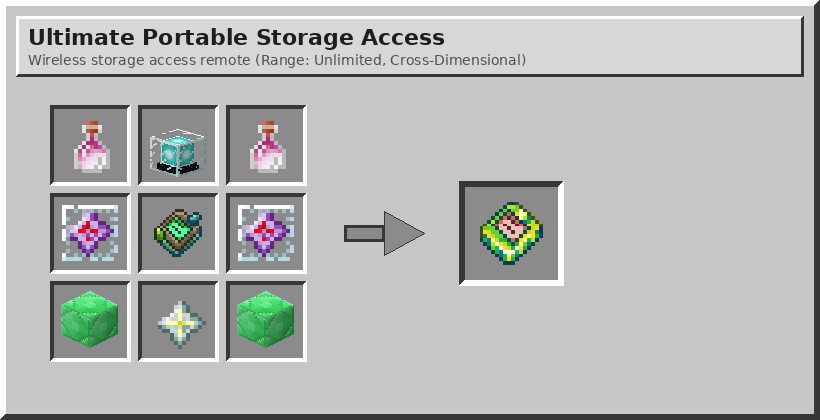

---

## 5. Portable Crafting Remotes

Wireless remotes with full 3x3 crafting grid and station support. Bind by **Sneak+Right-Clicking** a placed **Remote Storage Access** block.

### Basic Portable Crafting Access (PreHM)
- **Range:** 200 blocks (same dimension).
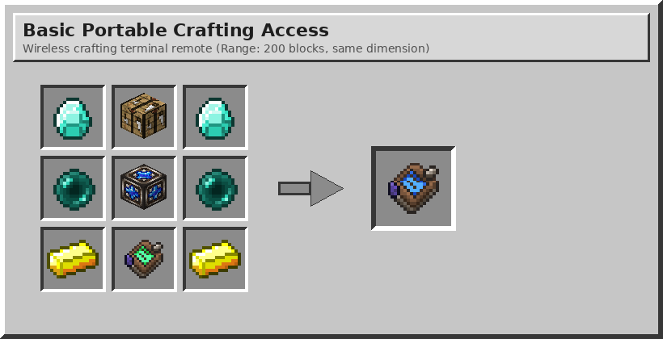

### Advanced Portable Crafting Access (HM)
- **Range:** Unlimited (same dimension).
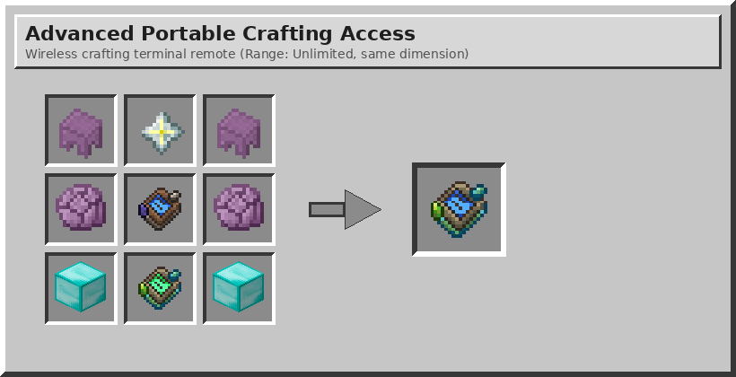

### Ultimate Portable Crafting Access
- **Range:** Unlimited across **all dimensions**.
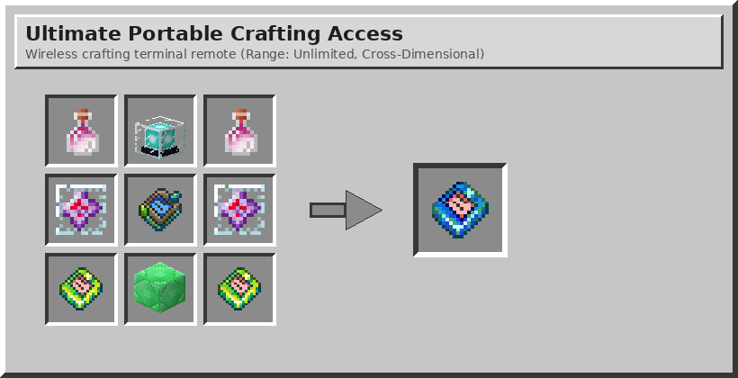

---

## 6. Dynamic Station Demonstrations

The **Crafting Access** dynamically reads all crafting station items placed inside the **Storage Heart's 20-slot inventory**.

### Furnace Smelting Demonstration
- **Station in Heart:** Furnace
- **Layout:** Center slot (Slot 5) holds fuel; outer slots (Slots 1-4, 6-9) hold identical smeltable inputs.
- **Mechanics:** Smelt ticks are dynamically calculated (200 ticks per item). Fuel is consumed probabilistically: $\frac{\text{Inputs} \times 200}{\text{Single Fuel Burn Ticks}}$.

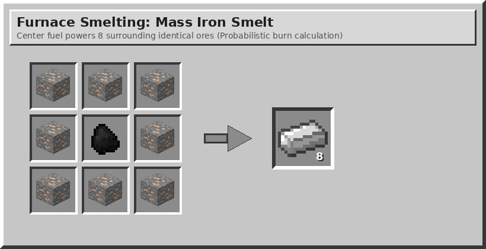

---

### Enchanting Table Demonstration
- **Station in Heart:** Enchanting Table
- **Layout:** Slot 1 holds the unenchanted item; Slots 4, 5, and 6 hold Lapis Lazuli.
- **Bookshelf Power:** Automatically scanned and calculated from all bookshelf items inside your network storage.

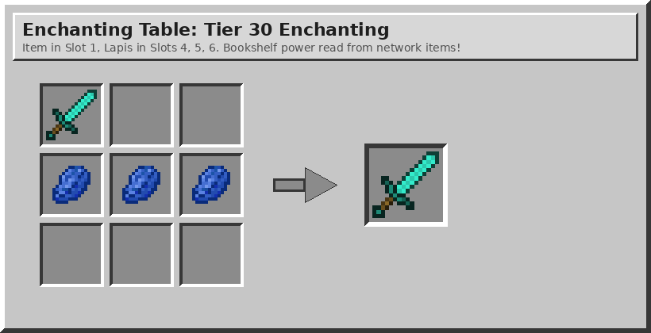

---

### Anvil Repair & Combination Demonstrations
- **Station in Heart:** Anvil
- **Layout:** Slot 1 holds the primary item; Slot 5 holds the repair material or secondary enchanted book.
- **Mechanics:** Calculates authentic vanilla repair durability, enchantment combining math, and XP level costs.

#### Anvil Item Repair
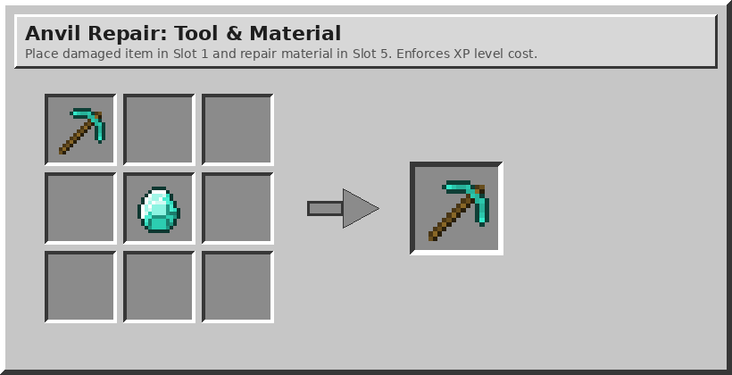

#### Anvil Enchantment Combining
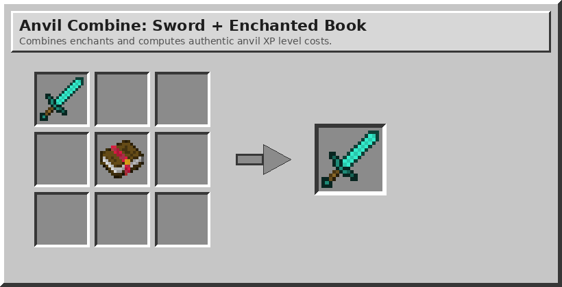

---

### Brewing Stand Demonstration
- **Station in Heart:** Brewing Stand
- **Layout:** Slot 1 = Blaze Powder, Slot 2 = Ingredient, Slots 4/5/6 = Potion bottles.
- **Mechanics:** Supports batch brewing 1 to 3 bottles with authentic 5% Blaze Powder consumption chance.

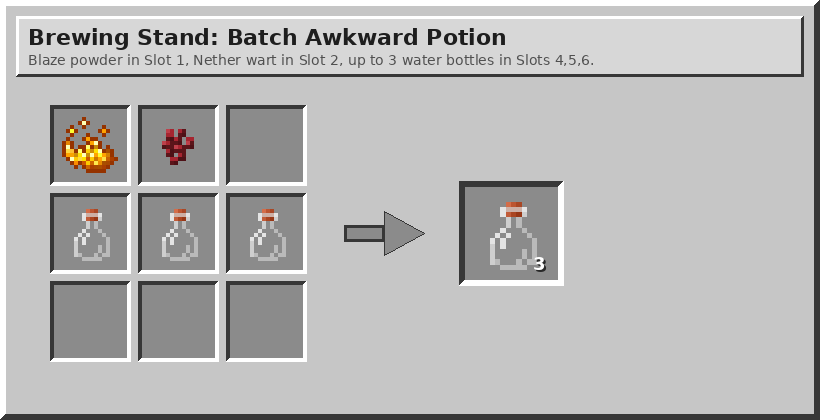

---

### Rustic Alchemy Demonstrations
- **Stations in Heart:** 1 Condenser + 3 Retorts (Simple or Advanced).
- **Mechanics:** Enforces burn-time tick minimums (400 ticks Simple / 300 ticks Advanced). Water buckets return empty buckets to storage when autofill is enabled.

#### Simple Alchemy: Elixir of Healing
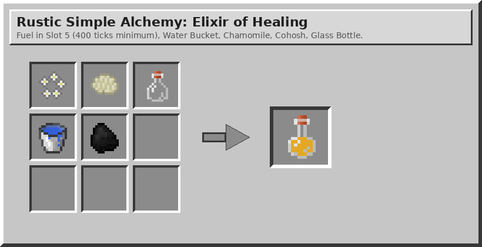

#### Advanced Alchemy: Elixir of Iron Skin
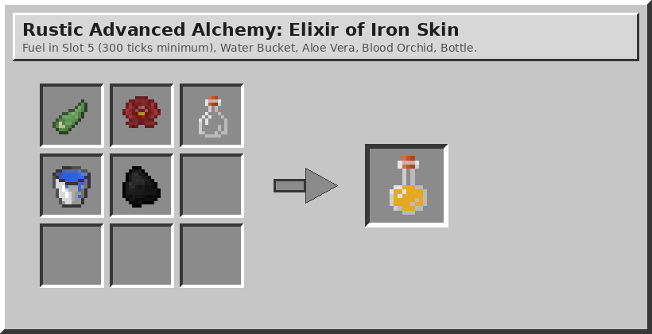

---

### Rustic Brewing Barrel Demonstration
- **Station in Heart:** Rustic Brewing Barrel
- **Layout:** Slot 1 holds fruits; Slot 5 holds optional modifier wine bottle.
- **Mechanics:** Modifier bottles preserve and boost wine quality. Unmodified brews yield baseline 0.36 or 0.72 quality.

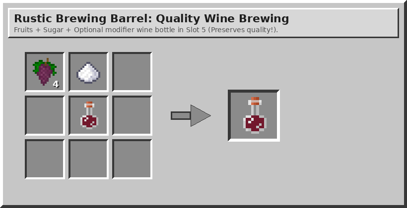

---

### Rustic Crushing Tub Demonstration
- **Station in Heart:** Rustic Crushing Tub
- **Layout:** Slot 1 = 4x Fruits (Grapes, Wildberries, Ironberries), Slot 5 = Empty Glass Bottle.
- **Mechanics:** Enforces 4-fruit batch consumption with crushing sound effects.

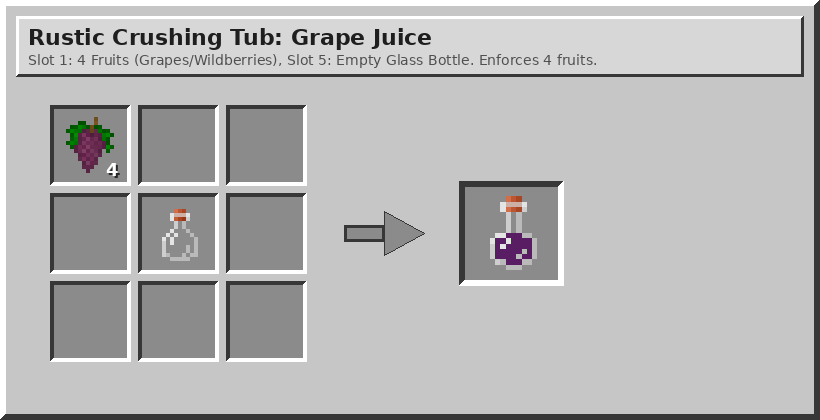

---

### Disenchanter Table Demonstration
- **Station in Heart:** Disenchantment Table
- **Layout:** Slot 5 = Enchanted Item, Slot 3 = Book.
- **Mechanics:** Extracts enchantments into an Enchanted Book; supports Voiding and Bulk disenchanters.

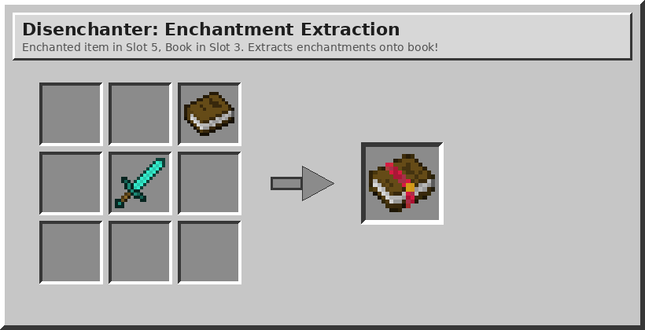

---

### Bountiful Baubles Reforger Demonstration
- **Station in Heart:** Reforger
- **Layout:** Slot 9 = Bauble Item.
- **Mechanics:** Reforges bauble modifier attributes using player XP levels.

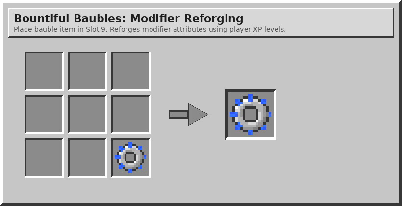

---

### Quality Tools Reforging Station Demonstration
- **Station in Heart:** Reforging Station
- **Layout:** Slot 5 = Tool/Armor/Bauble, Slot 9 = Reforging Material.
- **Mechanics:** Dynamically supports all 500+ materials (e.g. Spectral Silt for Bezoar, Leather for Tool Belts, Nether Stars, and OreDictionary tags).

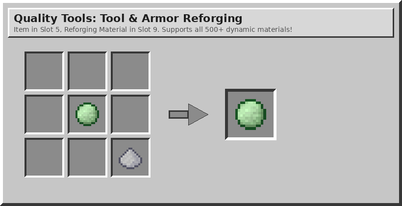

---

[← Back to Wiki Hub](../README.md) | [Main Documentation](../../README.md)
